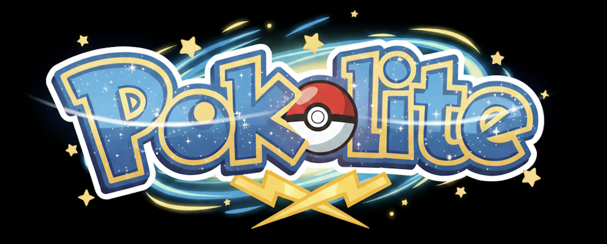
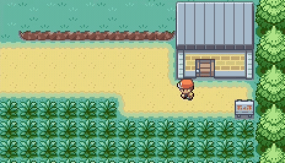
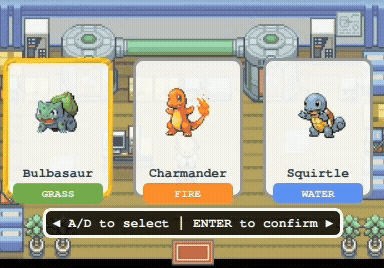
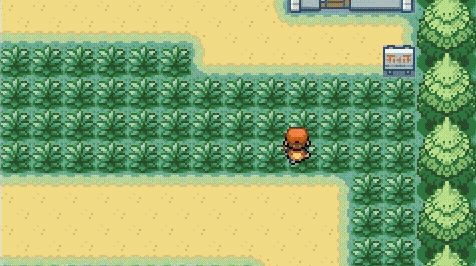

<p align="center">
  
</p>

A polished Pokémon-style RPG built with **C++** and the **Qt Framework**, designed for the **BeagleBone Black** with an LCD touchscreen display.  
Experience smooth overworld exploration, full turn-based battles, PvP multiplayer via UART, and custom battle animations optimized for embedded hardware.

---

## 🎮 Gameplay Features

<p align="center">
  
</p>

Explore maps, encounter Pokémon, and engage in classic turn-based combat featuring:

- **Attack** – 3 unique moves per Pokémon  
- **Items** – Potions, revives, and Pokéballs  
- **Switch** – Swap party members mid-battle  
- **Catch** – Capture wild Pokémon  
- **PvP Battles** – Real-time UART-linked battles between two BeagleBones  

Fight, level up, and build your team as you explore the world.

<p align="center">
  
</p>

---

## ⚔️ Battle Animations

- Pokéball throw arc with rotation  
- Attack hit/impact effects with screen shake  
- Pokémon movement animations (lunge → recoil)
- Smooth HP bar transitions with color cues  
- Fade-in/out battle transitions  
- Critical-hit white flash  

<p align="center">
  
</p>

---

## 🖥️ Interactive UI

- Clean four-option battle menu with cursor navigation  
- HP indicator boxes with pointer tails  
- Move selection with type labels  
- Bag interface with categorized items  
- Party menu with Pokémon stats + selection  

---

## 🔧 Embedded Systems Integration

- **Framebuffer Rendering:** Direct `/dev/fb0` drawing at 60 FPS  
- **Controller Input:** USB gamepad (D-Pad, A/B/X/Y, L/R, Start/Select)  
- **UART Communication:** Real-time PvP sync between two devices  
- **Boot Animation:** Game Boy-style splash intro  
- **ARM Optimized:** Compatible with BeagleBone userland + Qt C++17  

---

## 📁 Project Structure

```
General/          → Core backend logic & window handling  
Intro_Screen/     → Startup logo + intro sequence  
Overworld/        → Maps, collisions, player movement  
Battle/           → Full battle engine, UI, and animations  
assets.qrc        → Resource file (sprites, maps, UI graphics)  
QtPokemonGame.pro → Main Qt project configuration  
Makefile          → Build rules for Linux/ARM  
```

---

## 🚀 Entry Point

The game begins in:

```
General/main.cpp
```

It initializes the Qt application, displays the intro sequence, and transitions into the overworld.

---

## 🛠️ Build System

- **Qt Project File:** `QtPokemonGame.pro`  
- **Makefile:** `Makefile`  
- **Resource Pack:** `assets.qrc`  
- Supports **desktop debugging** and **ARM cross-compiling** for BeagleBone.

---

# 📜 UPDATE LOG

| Name | Date | Description |
|------|------|-------------|
| **ptnguy01** | 12/5/2025 | Battle system overhaul + animation fixes, added attack impact graphics, smoother frame transitions |
| **willjdes** | 12/5/2025 | `/etc/inittab` startup compatibility, UART stability improvements |
| **ptnguy01** | 12/4/2025 | Added trainer throw animation, intro sequence, tutorial lab map w/ starter selection |
| **willjdes** | 12/4/2025 | Major project folder clean-up, UART improvements |
| **willjdes** | 12/2/2025 | Added Pokéball catching + GUI fixes |
| **ptnguy01** | 11/24/2025 | Finished intro boot graphics |
| **willjdes** | 11/23/2025 | Added ARM Makefile compatibility (Qt: C++17, Logic: C++11) |
| **willjdes** | 11/20/2025 | Updated Pokémon JSON data + battle logic basics |
| **willjdes** | 11/19/2025 | Implemented Pokémon database parser |
| **ptnguy01** | 11/19/2025 | Added player animation + overworld collision |
| **ptnguy01** | 11/18/2025 | Uploaded graphics implementation to `feature/graphics` |
| **ptnguy01** | 11/17/2025 | Added initial movement logic |
| **willjdes** | 11/15/2025 | Gamepad support via xpad.c, tested with Tetris |
| **ptnguy01** | 11/14/2025 | Added controller.c + Makefile |
| **willjdes** | 11/13/2025 | Google doc planning |
| **willjdes** | 11/13/2025 | Repo created |

